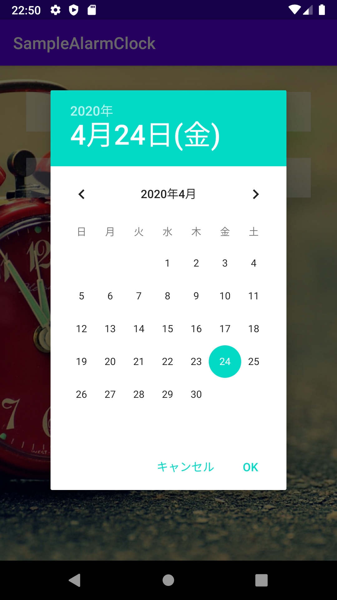
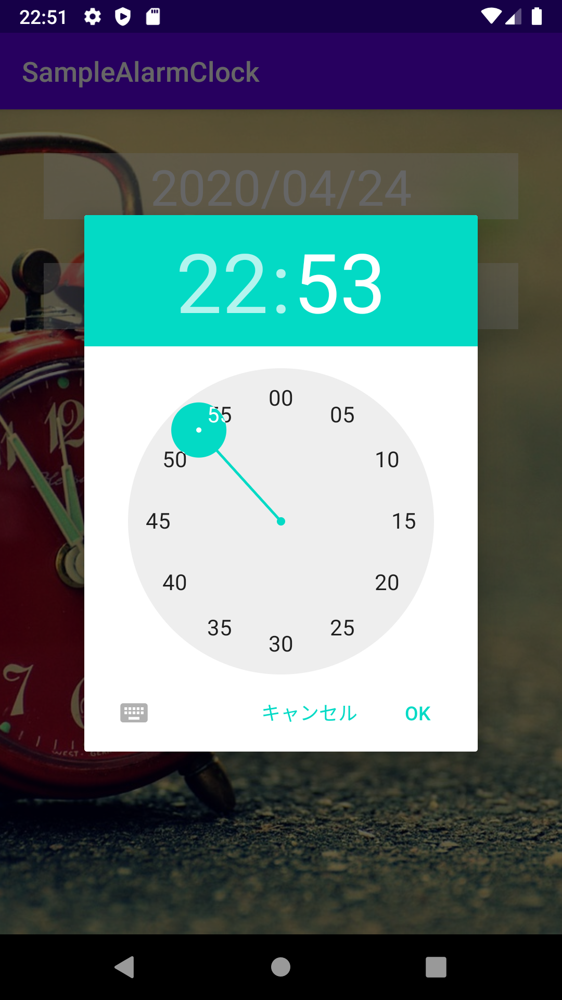
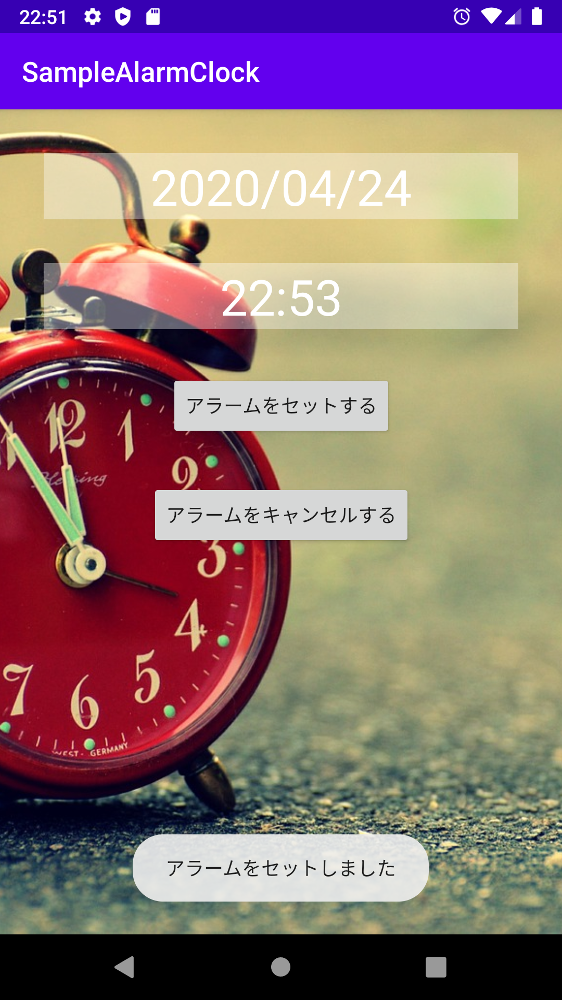

## アラームアプリ
日時を指定し、アラームをかけることができます。
また、アラームの時間になった際に表示されるダイアログで、5分後にスヌーズすることもできます。

    

### アラーム処理のプログラム
将来のある時点で処理を実行したい場合、AlarmManagerクラスとBroadCastReceiverクラスを利用します。

システムの起動完了、バッテリーの残量低下、設定した時刻での処理の実行など、Androidシステムで非同期に発生するイベントは、ブロードキャストという仕組みで情報(インテント)が送られてきます。このブロードキャストするインテントと、ブロードキャストする時間を設定しておくのがAlarmManagerで、受け取るのがBroadcastReceiverです。(登録したアラームは、デバイスがスリープだと保持されますが、オフになっているとクリアされちゃいます。)

### ダイアログを利用する
#### 簡単なアラートダイアログ
* DialogFragmentクラスを継承したクラスを作成する
* onCreateDialogメソッドでAlertDialogを作成する
* ここで作成したクラスのインスタンスを生成する
* showメソッドでダイアログを表示する

#### 日付と時刻を選択するダイアログ
日付
* DatePickerDialog.OnDateSetListenerを実装したクラスを用意する
* DatePickerDialogダイアログを作る
* 設定した結果をDatePickerDialog.OnDateSetListenerを実装したクラスのonDateSetメソッドで受け取る

時刻
* TimePickerDialog.OnDateSetListenerを実装したクラスを用意する
* TimePickerDialogダイアログを作る
* 設定した結果をTimePickerDialog.OnTimeSetListenerを実装したクラスのonTimeSetメソッドで受け取る

### スリープを解除する
MainActivity.ktのonCreate関数内を参照してください。笑
