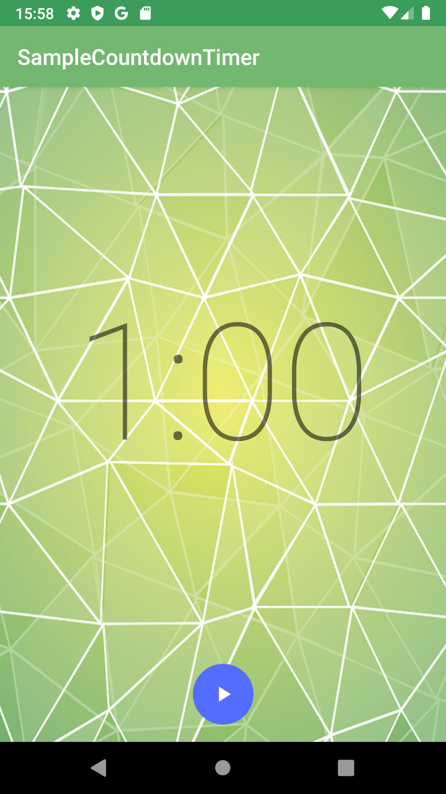
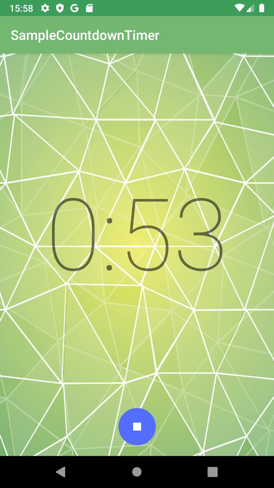

## カウントダウンタイマー
 

ボタンを押してスタートし、時間0になると音楽がなるといったタイマーアプリです。
初めて触れる機能やファイルが多々ありました。

### 学んだこと
・style.xmlやcolors.xmlを編集することで、画面の背景やステータスバーの色などを変更できる

・FloatingActionButtonは、その画面で最も一般的な動作を促すために使う(らしい。ようわからんが、メインのボタンはこれでいいってことだな。)

・SoundPoolクラスは複数の音を同時に鳴らすことができる(効果音など短いサウンドに適している)。

・音楽データはメモリを多く消費するので、onResumeでメモリにロードし、onPauseで開放するべき。
