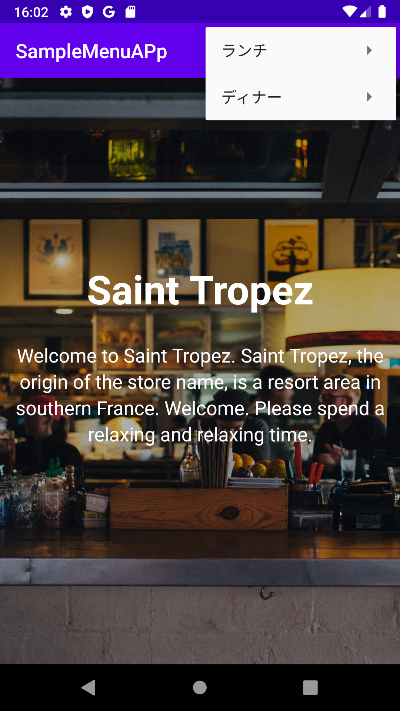
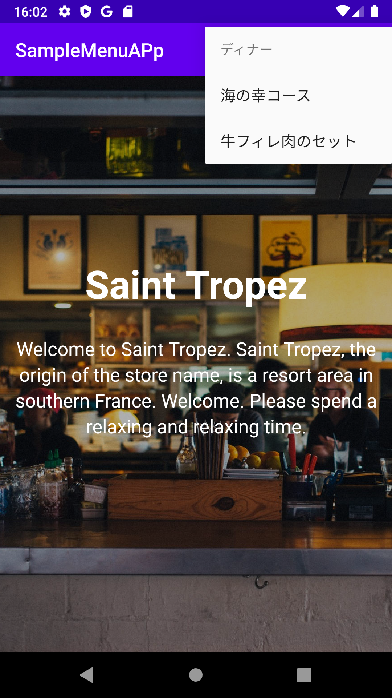
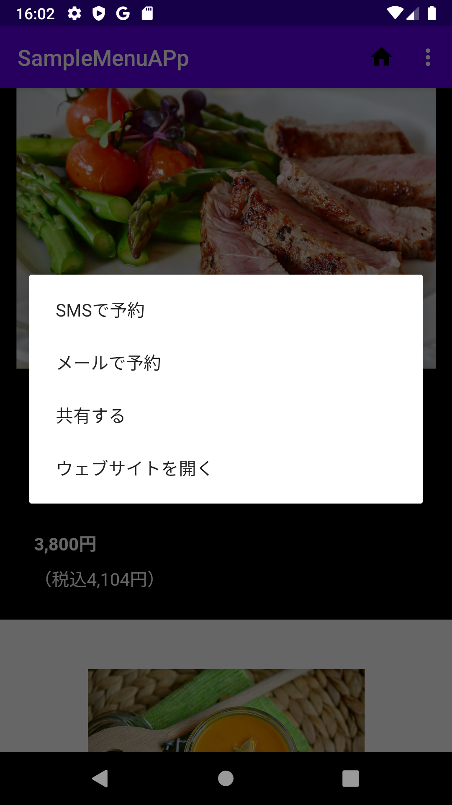
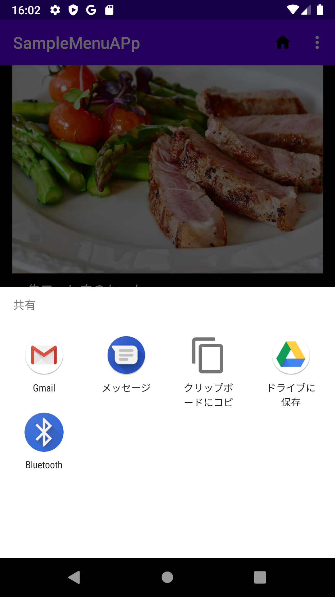

## メニューアプリ
画面右上のメニューからランチ/ディナーのメニューを選択し、表示させることができます。

また、画面長押しで出るコンテキストメニューから様々な操作を行うことができます。
  
  


### HTMLや画像を準備する
WebViewでHTMLで作成した画面を表示させます。

HTMLコンテンツは大抵、HTMLファイル、画像、スクリプトやCSSなど多数のファイルとフォルダで構成されます。

このようなフォルダ階層を保持したまま利用したリソースはassetsフォルダにおきます。

##### app右クリック→new→folder→assets folder→finishで作成。


### ベクタ形式の画像を利用する
build.gradleのdefaultConfigセクションに
```
vectorDrawables.useSupportLibrary = true
```
を記述する。


### オプションメニューを使う
使う手順は主に３つ。①メニューXMLファイルを用意。②onCreateOptionsMenuメソッドで、用意したメニューXMLを指定。③onOptionsSelectedメソッドにメニューが選択された時の処理を追記。
##### resを右クリック→new→android resource fileでresource typeにmenuを選ぶ


### 暗黙インテントを使う

