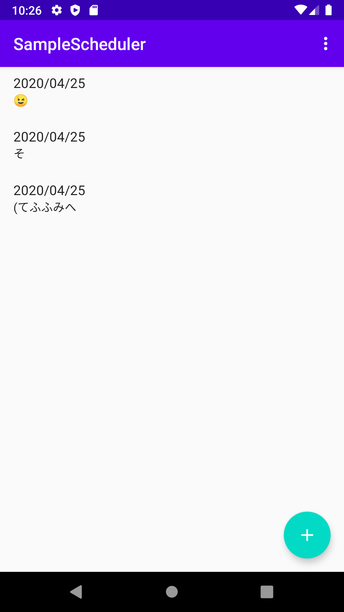

## スケジューラアプリ
### 学んだこと
* Realmの使い方
* RecyclerViewの使い方

 


### データベースとRecyclerViewを連携させなくてはならない
* build.gradleファイルを書き換え、RealmのGradleプラグインを適用する
* データベースを設定する
```
class MyApp : Application() {
  override fun onCreate() {
  super.onCreate()
  Realm.init(this)
}
```
のような感じで…

* 保存したいモデルを定義する
```
open class Model : RealmObject() {
  @PrimaryKey
  var id: Long = 0
  var date: Date = Date()
  var title: String = ""
  var detail: String = ""
}
```
のような感じで、、、

* データベースを取得する
```
class MainActivity : AppCompatActivity() {
  private lateinit var realm: Realm
  override fun onCreate(...) {
    ...
    realm = Realm.getDefaultInstance()
    ...
  }
  
  override fun onDestroy() {
    super.onDestroy()
    realm.close()
  }
}
```
のような感じで、、、
